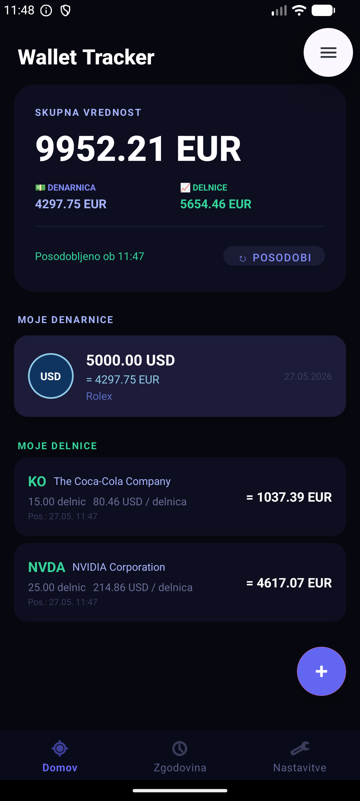

# 💼 Wallet Tracker

> Android aplikacija za sledenje denarne vrednosti valut in delnic v realnem času — vse na enem mestu.

---

## 📱 O aplikaciji

**Wallet Tracker** je Android aplikacija za osebno upravljanje portfelja. Omogoča dodajanje različnih valut in delnic, samodejno pretvorbo v EUR (ali drugo prikazno valuto) ter prikaz zgodovine vrednosti portfelja z interaktivnimi grafi.

Aplikacija je bila razvita kot projektna naloga na **Univerzi v Ljubljani, Fakulteti za elektrotehniko (FE UL)**.

---

## ✨ Funkcionalnosti

### 🏠 Domača stran
- Prikaz **skupne vrednosti portfelja** (denarnica + delnice)
- Ločen seštevek za valute in delnice
- Samodejno osveževanje tečajev na 30 minut
- Seznam vseh vnosov z možnostjo urejanja in brisanja

### 💱 Dodajanje valut
- Podprte valute: USD, EUR, GBP, JPY, CHF, CAD, AUD, CNY, CZK
- Realnočasovna konverzija v EUR prek [Frankfurter API](https://www.frankfurter.app/)
- Možnost urejanja obstoječih vnosov

### 📈 Delnice
- Iskanje po **ticker simbolu** (npr. `AAPL`, `NVDA`, `TSLA`)
- Pridobivanje cen prek **Yahoo Finance API**
- Samodejno posodabljanje vrednosti portfelja
- Podpora za delnice v različnih valutah (USD, EUR, GBP ...)

### 📊 Zgodovina
- **Stolpčni** in **črtni** graf vrednosti portfelja skozi čas
- Filtri: zadnji teden / mesec / 3 mesece / vse
- Prikaz trenda s % spremembo
- Pravilna osnova za filtrirane poglede (vidi vrednost portfelja na začetku izbranega obdobja)

### ⚙️ Nastavitve
- Izbira **prikazne valute** (EUR, USD, GBP, JPY, CHF, CAD, AUD, CNY, CZK)
- Vse vrednosti se samodejno preračunajo

---

## 🛠️ Tehnologije

| Komponenta | Tehnologija |
|---|---|
| Jezik | Java |
| Minimalni Android | API 24 (Android 7.0) |
| Ciljni Android | API 34 (Android 14) |
| Baza podatkov | Room (SQLite) |
| Grafi | MPAndroidChart |
| UI | Material Design 3 |
| Tečaji valut | [Frankfurter API](https://www.frankfurter.app/) |
| Cene delnic | Yahoo Finance API |

---

## 📸 Zaslonski posnetki



---

## 🚀 Namestitev

### Predpogoji
- Android Studio (Hedgehog ali novejši)
- JDK 17+
- Android SDK 34

### Koraki

```bash
# 1. Kloniraj repozitorij
git clone https://github.com/tvoj-username/wallet-tracker.git

# 2. Odpri projekt v Android Studiu
# File → Open → izberi mapo WalletTrackerFull

# 3. Sinhroniziraj Gradle
# Android Studio bo samodejno predlagal sinhronizacijo

# 4. Zaženi na emulatorju ali fizični napravi
# Run → Run 'app'
```

> Aplikacija ne zahteva nobenega API ključa — Frankfurter API in Yahoo Finance sta brezplačna in javno dostopna.

---

## 🗂️ Struktura projekta

```
app/src/main/java/si/uni_lj/fe/tnuv/wallettracker/
│
├── activity/
│   ├── DashboardActivity.java     # Glavna aktivnost z vsemi sekcijami
│   ├── AddEntryActivity.java      # Dodajanje valutnih vnosov
│   └── ChartActivity.java         # Graf zgodovine
│
├── adapter/
│   ├── WalletAdapter.java         # RecyclerView adapter za valute
│   └── StockAdapter.java          # RecyclerView adapter za delnice
│
├── api/
│   ├── ExchangeRateApi.java       # Frankfurter API za tečaje
│   └── StockApi.java              # Yahoo Finance API za delnice
│
├── database/
│   ├── WalletDatabase.java        # Room baza
│   ├── WalletEntryDao.java        # DAO za valutne vnose
│   └── StockEntryDao.java         # DAO za delnice
│
└── model/
    ├── WalletEntry.java           # Model valutnega vnosa
    └── StockEntry.java            # Model delnice
```

---

## 🔌 API-ji

### Frankfurter API
Brezplačen, odprtokoden API za devizne tečaje z bazno valuto EUR.

```
GET https://api.frankfurter.app/latest?from=EUR
```

Aplikacija hrani tečaje v predpomnilniku za 10 minut in ima vgrajene rezervne tečaje za primer izpada omrežja.

### Yahoo Finance API
Pridobivanje realnočasovnih cen delnic po ticker simbolu.

```
GET https://query1.finance.yahoo.com/v8/finance/chart/{TICKER}
```

---

## 📝 Licenca

Ta projekt je bil razvit za izobraževalne namene v okviru študija na FE UL.

---

## 👨‍💻 Avtor
Blaž Cussigh
Jaka Čemažar
Razvito na **Univerzi v Ljubljani, Fakulteti za elektrotehniko**  
Predmet: Telekomunikacijska omrežja in upravljanje računalnikov (TNUV)
